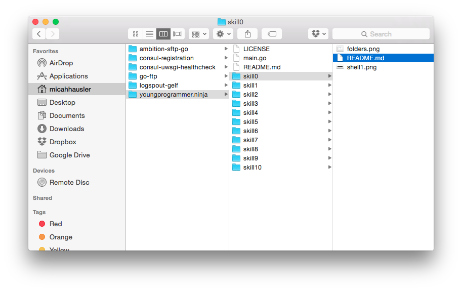
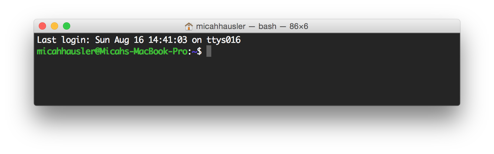
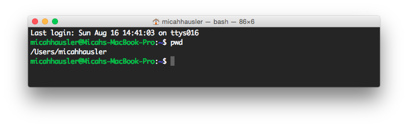
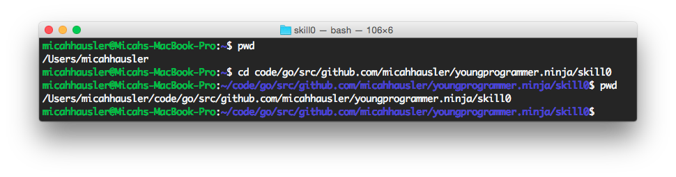
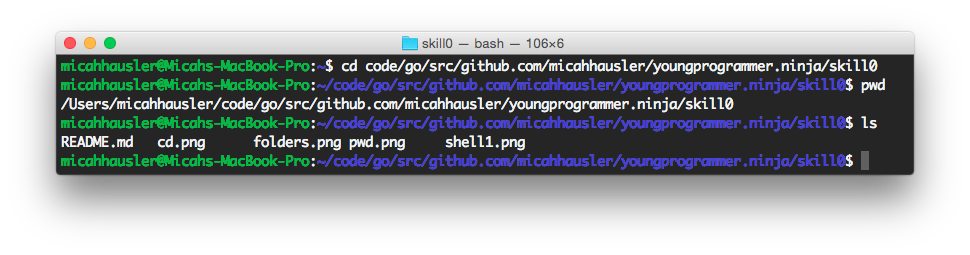

# Skill 0 - The Basics: Learning the Terminal
(Its not scary!)


## Files and folders on your computer
You know how you have files within folders stored on your computer? It might look like this:


We would say that the "skill0" folder is inside "youngprogrammer.ninja". The picture you see above, is a visual representation of this. 

On my computer, the "full path" for that folder is 

```
/Users/micahhausler/code/go/src/github.com/micahhausler/youngprogrammer.ninja
```

When you open a terminal window, the first thing you'll see is some text that probably ends in a dollar sign. This is known as a "shell." If it helps, think of an "S" with an "L" going through it.




## Where am I?
In the 'Finder' when you open a folder, that is called the "working directory." The terminal works the same way, and to find the working directory, all you have to run is the command `pwd`. This is short for "print working directory".

To run commands, just type the command you want to run, and press the enter key.



We can see that my "working directory" is `/Users/micahhausler`. This is called my "home" directory.

## Moving Around
It wouldn't be very useful if you could only run programs in your home folder, so you will need to change your directory. The command for this is called `cd`, short for "change directory". Since I want to go to the `youngprogrammer.ninja` directory I'll run the `cd` program and then follow it with the destination. 



## Where are my files?
Just like you need to move around, you need to know what is in a directory! The command for this is just two letters, `ls`. Think of this as "**L**I**S**T directory"



When I ran `ls` in the directory `code/go/src/github.com/micahhausler/youngprogrammer.ninja/skill0`, the `ls` program told me the files in my `skill0` directory.

# Terms To Remember

- "shell" - Where you navigate the computer using text
- "directory" - Another word for a folder
- "home" - The directory where your personal files are stored in or under.

# Commands To Remember

- `cd` - Change directory 
- `ls` - List directory
- `pwd` - "Print working directory"
- `touch` - Create a new empty file
- `clear` - Clear your terminal screen